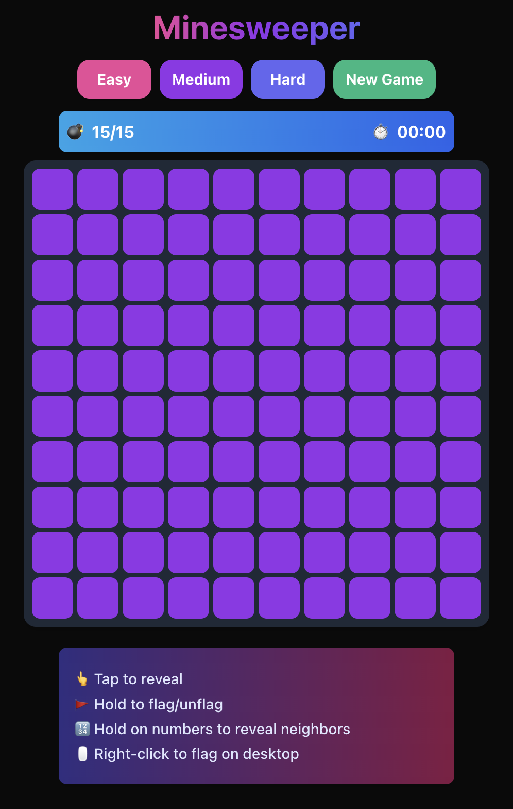

# Modern Minesweeper

A sleek, modern implementation of the classic Minesweeper game built with Next.js, TypeScript, and Tailwind CSS. Features a responsive design, touch support, and dark mode.



## 🎮 Play Now

[Add your deployed game URL here]

## ✨ Features

- 🎯 Three difficulty levels: Easy (10x10), Medium (16x16), and Hard (16x30)
- 🌓 Light/Dark theme with system preference detection
- 📱 Full touch support for mobile devices
- 🎨 Modern, responsive UI with smooth animations
- ⌨️ Desktop and mobile-optimized controls
- 🎆 Visual feedback for all actions
- ♿ Accessibility features

## 🚀 Getting Started

### Prerequisites

- Node.js 18.0 or higher
- npm or yarn

### Installation

1. Clone the repository
   ```bash
   git clone https://github.com/yourusername/minesweeper.git
   cd minesweeper
   ```

2. Install dependencies
   ```bash
   npm install
   # or
   yarn install
   ```

3. Start the development server
   ```bash
   npm run dev
   # or
   yarn dev
   ```

4. Open [http://localhost:3000](http://localhost:3000) in your browser

## 🎯 How to Play

### Desktop Controls
- Left Click: Reveal a cell
- Right Click: Flag/unflag a cell
- Right Click on Numbers: Reveal adjacent cells when correct number of flags are placed

### Mobile Controls
- Tap: Reveal a cell
- Long Press: Flag/unflag a cell
- Long Press on Numbers: Reveal adjacent cells when correct number of flags are placed

## 🛠️ Built With

- [Next.js](https://nextjs.org/) - React framework
- [TypeScript](https://www.typescriptlang.org/) - Type safety
- [Tailwind CSS](https://tailwindcss.com/) - Styling
- [React](https://reactjs.org/) - UI Components

## 🎨 Color Scheme

The game features a carefully chosen color palette:
- Unrevealed cells: Purple (#9333ea)
- Flagged cells: Green (#22c55e)
- Mine cells: Pink (#ec4899)
- Numbers: Color-coded 1-8 for easy recognition
- Gradients for UI elements and instructions

## 🌓 Theme Support

- Automatically detects system color scheme preference
- Manually toggleable between light and dark modes
- Persists theme choice in local storage
- Optimized contrast ratios for both themes

## 📱 Mobile Optimization

- Responsive grid sizing
- Touch-optimized controls
- Prevent unwanted gestures (pull-to-refresh, double-tap zoom)
- Compact UI for smaller screens
- Visual feedback for touch actions

## 🔧 Development

```bash
# Run development server
npm run dev

# Build for production
npm run build

# Start production server
npm start

# Run linter
npm run lint
```

## 📝 License

This project is licensed under the MIT License - see the [LICENSE](LICENSE) file for details.

The MIT License is a permissive license that is short and to the point. It lets people do anything they want with your code as long as they provide attribution back to you and don't hold you liable.

```text
MIT License

Copyright (c) 2025 Saadiq Rodgers-King

Permission is hereby granted, free of charge, to any person obtaining a copy
of this software and associated documentation files (the "Software"), to deal
in the Software without restriction, including without limitation the rights
to use, copy, modify, merge, publish, distribute, sublicense, and/or sell
copies of the Software, and to permit persons to whom the Software is
furnished to do so, subject to the following conditions:

The above copyright notice and this permission notice shall be included in all
copies or substantial portions of the Software.

THE SOFTWARE IS PROVIDED "AS IS", WITHOUT WARRANTY OF ANY KIND, EXPRESS OR
IMPLIED, INCLUDING BUT NOT LIMITED TO THE WARRANTIES OF MERCHANTABILITY,
FITNESS FOR A PARTICULAR PURPOSE AND NONINFRINGEMENT. IN NO EVENT SHALL THE
AUTHORS OR COPYRIGHT HOLDERS BE LIABLE FOR ANY CLAIM, DAMAGES OR OTHER
LIABILITY, WHETHER IN AN ACTION OF CONTRACT, TORT OR OTHERWISE, ARISING FROM,
OUT OF OR IN CONNECTION WITH THE SOFTWARE OR THE USE OR OTHER DEALINGS IN THE
SOFTWARE.
```

## 👏 Acknowledgments

- Inspired by the classic Minesweeper game
- Icons from [Feather Icons](https://feathericons.com/)

---

Made with ❤️ by Saadiq Rodgers-King